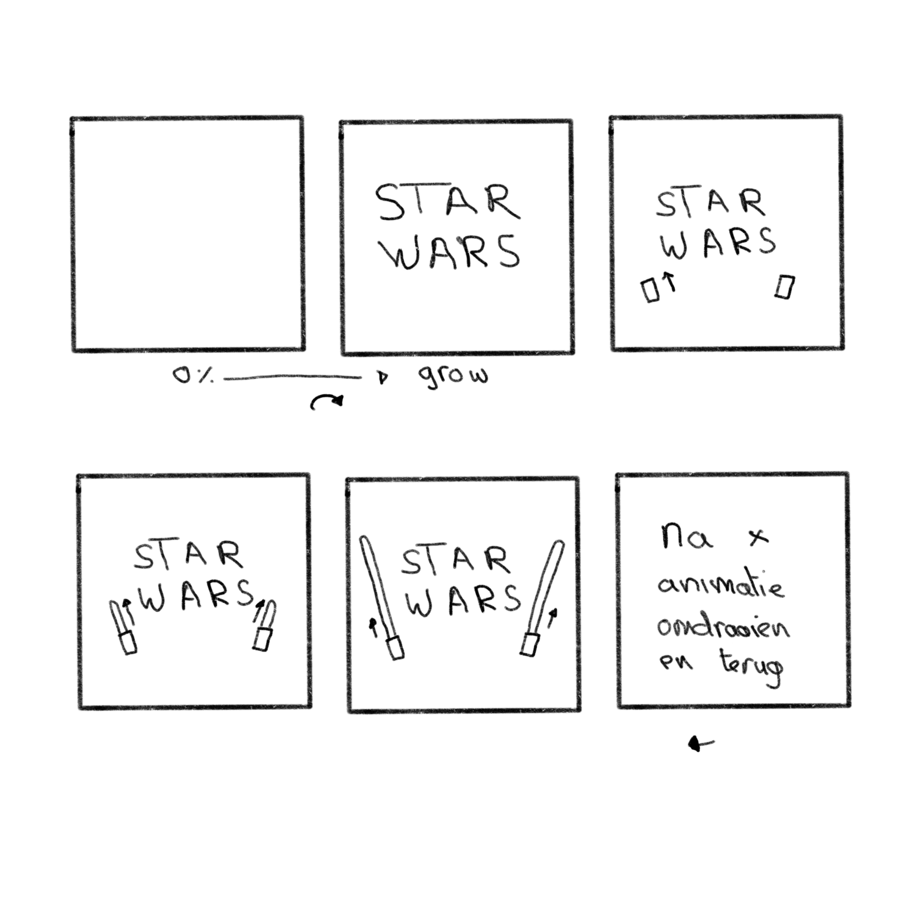
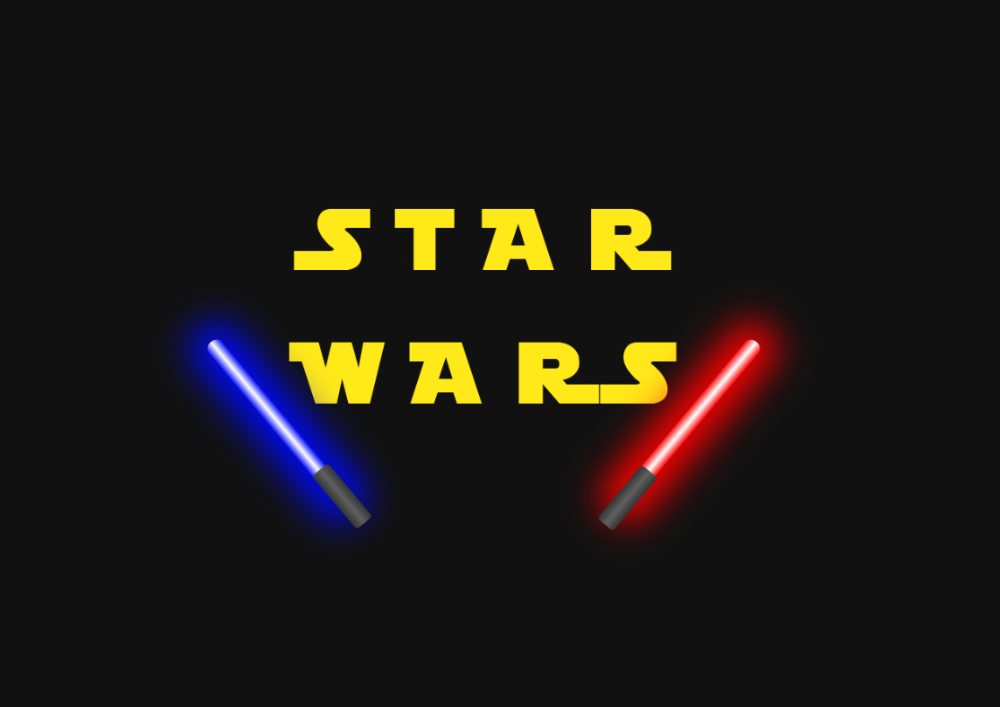

# Procesverslag
**Auteur:** Marijn de Bruin | 500844761 | CMD 202 |

**De opdrachten:** [opdracht 1](opdracht1/index.html) en [opdracht 2](opdracht2/index.html)

Markdown is een simpele manier om HTML te schrijven.  
Markdown cheat cheet: [Hulp bij het schrijven van Markdown](https://github.com/adam-p/markdown-here/wiki/Markdown-Cheatsheet).

Nb. De standaardstructuur en de spartaanse opmaak van de README.md zijn helemaal prima. Het gaat om de inhoud van je procesverslag. Besteedt de tijd voor pracht en praal aan je website.

Nb. Door *open* toe te voegen aan een *details* element kun je deze standaard open zetten. Fijn om dat steeds voor de relevante stuk(ken) te doen.

## Bronnenlijst
  1. STAR WARS font: STAR JEDI: https://www.dafont.com/star-jedi.font
  2. Motion Blur voor inspiratie https://codepen.io/joshbader/pen/eYYLEY

## Opdracht 1 plan

  
uitwerken na schetsen idee (voor week 2)

  ### Je storyboard:
  

  ### Je ambitie: 
  Aan deze technieken/punten wil ik werken:
  - Ik wil meer css technieken leren
  - Ik wil mooie vloeiende animaties kunnen maken
  - Ik wil nette code schrijven en gebruik maken van variables
 

## Opdracht 1 reflectie

  
uitwerken bij afronden opdracht (voor week 3)

  Ik vond het een uitdaging om een animatie te maken met alleen HTML en CSS. Ik heb veel geleerd tijdens deze opdracht, waar ik anders een SVG of afbeelding voor zou gebruiken heb ik het nu met CSS gemaakt. Ik heb mijzelf weer verder aangeleerd om minder divs te gebruiken en dat is gelukt. Aan het begin had ik er meer dan nu.
  Ik ben zeer tevreden met de uitkomst en vind het een mooi resultaat.

  ### Je uitkomst - karakteristiek screenshot(s):
  

  ### Dit ging goed/Heb ik geleerd: 
  Korte omschrijving
  - Ik heb geleerd hoe je CSS animaties kan maken
  - Ik heb geleerd dat je meerdere animaties op een object kan zetten doormiddel van een "animatie1, animatie2" dit werkt ook bij animation-delay
  - Ik heb geleerd hoe je met CSS een "tekening" kan maken.
  - Ik heb verschillende transform geleerd
  - Ik heb geleerd om ::before en ::after te gebruiken.

  ### Dit was lastig/Is niet gelukt:
  Korte omschrijving
  - Ik vond het lastig om geen divs te gebruiken.
  - Ik vond het lastig om ::before en ::after werkend te krijgen (is wel gelukt!)
  - Ik had graag nog een achtergrond gemaakt, maar dit was lastig. Ik wou namelijk Star Wars lightspeed willen maken.

## Opdracht 2 plan

  
uitwerken na schetsen idee (voor week 4)

  Ik hou van honden, veel beter dan katten :D

  Er zijn genoeg mensen die van honden houden en graag een hond zouden willen hebben of zien, maar dat niet kunnen. Daarom is er nu Daily Dogs! Voel je je even down? Heb je een belangrijke meeting? Of werkt je code niet? of wil je gewoon even een hond zien, dan kan je naar Daily Dogs en kan je je dagelijkse dosis aan cute honden fotos binnenkrijgen. Nooit meer op google kijken en elke week dezelfde top resultaten zien. Daily Dogs maakt gebruik van een willekeurige honden kiezer waardoor je altijd een nieuwe hond ziet.

  ### Je ontwerp:
  

  ### Je ambitie: 
  Aan deze technieken/punten wil ik werken:
  - Meer nieuwe Javascript functies leren.
  - Een API koppelen en gebruiken
  - Meer Animaties want je hebt er nooit genoeg!
  - Honden heel veel honden

## Opdracht 2 test

  
uitwerken na testen (week 6/7)

  - Nog geen darkmode
  - IPV vooraf gekozen content zoals fotos kan je een foto API gebruiken.

  ### Bevinding 1:
  Ik had nog geen Darkmode gemaakt voor de app.

  #### oplossing:
  Ik ben begonnen met een @media query om er voor te zorgen dat als de gebruiker darkmode aan heeft staan bij zijn device dat deze dan automatisch overschakeld. Ik kwam er vrij snel achter nadat ik dit had toegepast dat ik all mijn variables voor kleuren verkeerd had benoemt...
  Ik had namelijk in de root:
  --wit: #fff;
  --zwart: #000;
  @media (prefers-color-scheme: dark) {
  --wit: #000;
  --zwart: #fff;
  }
  Ik had het even op deze manier opgelost maar dat is niet heel gebruiksvriendelijk dus heb ik de variables andere namen gegeven.
  --text: #000;
  --container: #FFF;

  

  Ik heb hieruit geleerd dat het belangrijk is dat je de variables duidelijke namen geeft, en dat ze voor beide themas toepassbaar zijn. Bijvoorbeeld voor een H1 color doe je --texth1 ipv --zwart hierdoor is de naam toepassbaar voor beide themas.

  ### Bevinding 2:
  Daily dogs maakte gebruik van een aantal vooraf gekozen fotos van mijn huidige honden en mijn vorige honden..RIP. Ik zou de app beter kunnen maken als de fotos willekeurig gekozen worden. Dit kan ik doen doormiddel van een DOG API

  #### oplossing:
  Ik heb opgezocht welke API willekeurige honden fotos kan inladen. Toen kwam ik uit op deze API: https://dog.ceo/dog-api/. Deze API heeft een hele grote lijst met allemaal honden fotos die mensen zelf hebben opgestuurd. Er zit heel veel verschill in kwaliteit van de honden fotos, van net 300px breed tot 4k fotos. 

  Ik heb de gitHub gelezen en bekeken hoe het werkt. Ze hebben een voorbeeld van hoe het werk met vanillaJS dus die code heb ik geimplementeerd in mijn eigen werk. 

  Het is vrij simpel. De functie plaats een request bij de API. De request word beantwoord met een .json bestand. We kijken in het .json bestand en vinden 2 regels. Message en status. de status is er puur zodat je weet of de request is gelukt. In de message zit een link naar de willekeurige afbeelding. Dan halen we uit de message de link en plaatsen we deze in de html.

  

  Ik heb geleerd hoe API's werken en hoe je deze gemakkelijk kan implementeren. Hierdoor kan je gemakkelijk je website een stuk uitgebreider maken met werkende functies.

## Opdracht 2 reflectie

  
uitwerken bij afronden opdracht (voor week 8)

  ### Je uitkomst - karakteristiek screenshot(s):
  

  ### Dit ging goed/Heb ik geleerd: 
  - Ik heb mijn javascript kennis weer bijgespijkerd.
  - Ik heb geleerd hoe je een API kan implementeren
  - Ik heb geleerd dat variables goeie namen geven belangrijk is!
  - Ik heb weer meer geleerd over animaties
  - Ik heb weer meer gelet op semantische HTML en CSS
  - Ik heb duidelijke code geschreven.

  ### Dit was lastig/Is niet gelukt:
  - Ik heb geleerd dat '' & `` hele verschillende dingen zijn, Dit heeft echt niet voor een hele dag
  aan debuggen gezorgt... -_-
  - Ik had moeite met een class toevoegen en na x tijd te verwijderen. 
  

